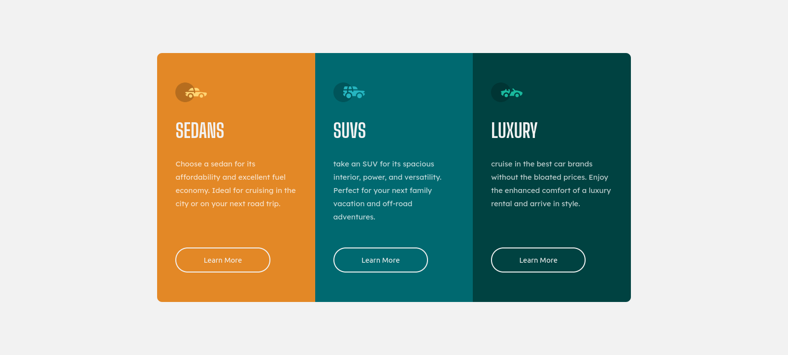

# Frontend Mentor - 3-column preview card component solution

This is a solution to the [3-column preview card component challenge on Frontend Mentor](https://www.frontendmentor.io/challenges/3column-preview-card-component-pH92eAR2-). Frontend Mentor challenges help you improve your coding skills by building realistic projects.

## Table of contents

-   [Overview](#overview)
-   [Screenshot](#screenshot)
-   [Links](#links)
-   [Built with](#built-with)
-   [Author](#author)

## Overview

Simple 3 column preview card using HTML and CSS

### Screenshot

### Links

-   Solution URL: [Github repo](https://github.com/AhmedLebda/Frontend-Mentor-three-column-card.git)
-   Live Site URL: [Live Site URL](https://ahmedlebda.github.io/Frontend-Mentor-three-column-card/)

### Built with

-   Semantic HTML5 markup
-   CSS custom properties
-   Flexbox
-   CSS Grid
-   Mobile-first workflow

## Author

-   Github - [Ahmed Lebda](https://github.com/AhmedLebda)
